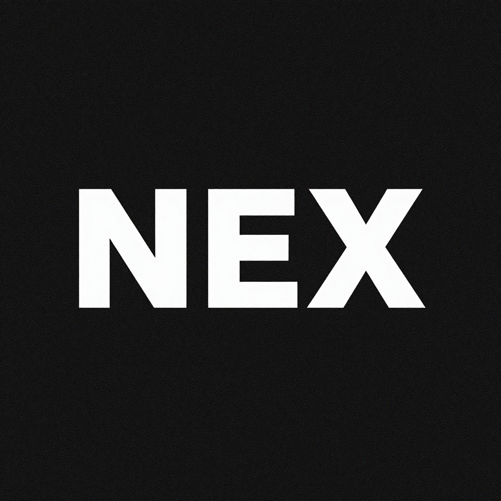

<div align=center>

<h2>NexDB</h2>
</div>

[English](README.en.md) | 简体中文

### 一、功能简述
- 轻量级开源数据库管理工具：约 25 MB 单包，无需 Java、Python 运行时，不内嵌 Chromium，支持 macOS、Windows、Linux。
- 一个工具连接 90+ 数据库：MySQL、PostgreSQL、SQLite、Redis、MongoDB、DuckDB、ClickHouse、SQL Server、Oracle、Elasticsearch、TiDB、OceanBase、openGauss、达梦、TDengine、InfluxDB 等，支持原生驱动、Agent/JDBC 扩展，以及 Pulsar、Kafka、RocketMQ 消息队列管理。
- 桌面端、Docker/Web、CLI 三种形态，同一份连接配置处处可用。
- 内置 AI SQL 助手：自然语言生成 SQL、解释、优化与纠错，内置安全检查；支持 Claude、OpenAI、Ollama 本地模型及 OpenAI 兼容端点。
- 内置 MCP Server，Claude Code、Cursor、Windsurf 等 AI 编程助手可直接查询已配置的数据库。
- 查询编辑器、虚拟滚动数据表格、Schema 工具、ER 图、Schema 对比、执行计划、数据导入导出/迁移对比、Redis/MongoDB 专项浏览器、SSH 隧道、加密配置导入导出。

### 二、部署方式
1. 桌面端：从 [Releases](https://github.com/Mutantcat-Working-Group/NexDB/releases/latest) 下载最新安装包。
   ```
   # macOS
   brew install --cask dbx

   # Windows
   winget install t8y2.dbx

   # Linux
   flatpak remote-add --if-not-exists flatpark https://dl.flatpark.org/flatpark.flatpakrepo
   flatpak install flatpark org.mutantcat.nexdb
   ```
   Linux 用户也可通过[星火应用商店](https://spk-resolv.spark-app.store/?spk=spk://store/development/dbx)一键安装。
2. Docker 自托管（Web 版）：浏览器访问 `http://localhost:4224`。
   ```
   docker run -d --pull=always --name nexdb -p 4224:4224 -v nexdb-data:/app/data t8y2/dbx:latest
   ```
   中国大陆可改用 `docker.cnb.cool/dbxio.com/dbx:latest` 加速拉取；Compose 部署见 `deploy/docker-compose.release.yml`。
3. CLI：
   ```
   npm install -g @dbx-app/cli
   ```
4. 源码构建：Node.js >= 18、pnpm、Rust >= 1.88。运行 `make` 启动本地开发环境，`make package` 产出安装包。

### 三、使用教程
1. 新建连接：选择数据库类型，填写地址、账号与密码，保存后即可查询。
2. AI 助手：用自然语言描述需求生成 SQL，检查无误后执行；已有 SQL 可进行解释、优化或纠错。
3. MCP 集成：在 AI 编程助手中启动 MCP Server。
   ```
   npx @dbx-app/mcp-server
   ```
   在 `.mcp.json` 中添加：
   ```json
   {
     "mcpServers": {
       "nexdb": { "command": "npx", "args": ["-y", "@dbx-app/mcp-server"] }
     }
   }
   ```
   连接 Web/Docker 部署时需设置 `DBX_WEB_URL`，登录页有密码时再设置 `DBX_WEB_PASSWORD`。
4. CLI 使用：
   ```
   dbx connections list --json
   dbx query local "select 1" --json
   ```
5. 数据操作：导入 CSV/Excel、跨库迁移、完整导出、数据对比、执行 `.sql` 文件，拖入 Parquet、CSV、JSON 文件即可即时预览。

### 四、接口文档
1. MCP Server
   - 说明：为 MCP 兼容的 AI 编程助手提供数据库能力，服务名为 `org.mutantcat.nexdb`；支持列出连接、浏览表、执行 SQL、在 NexDB 界面中打开表。
   - 安装：`npx @dbx-app/mcp-server`；macOS、Linux、Windows 预编译二进制见 [Releases](https://github.com/Mutantcat-Working-Group/NexDB/releases)。
   - 权限：在“设置 → MCP”中管理连接 allowlist 与“只读 / 数据读写 / 完全访问”三档执行权限。
   - 环境变量：Web/Docker 部署使用 `DBX_WEB_URL`、`DBX_WEB_PASSWORD`；Windows 便携版还需 `DBX_DATA_DIR` 指向 data 目录。
2. Web API
   - 说明：Docker/Web 部署的 HTTP API。
   - 文档：[docs/content/docs/web-api.cn.mdx](docs/content/docs/web-api.cn.mdx)，示例见 [examples/](examples/)。

### 五、专注的点
- 轻量：约 25 MB，无运行时依赖，全平台原生体验。
- 广度：90+ 数据库统一入口，原生驱动、Agent 配置与自定义 JDBC 均可扩展。
- AI 原生：SQL 助手与 MCP 均为内置能力而非插件，数据直接接入 AI 编程助手。
- 多形态：桌面端、Docker/Web、CLI 同一代码库、同一连接配置。
- 工程化：SSH 隧道、断线重连、危险操作确认、加密配置、自动更新。

### 六、开发进度
- [X] 桌面端（Tauri 2 + Vue 3）
- [X] Docker/Web 版本
- [X] CLI 与脚本工作流
- [X] 90+ 数据库连接与 Agent/JDBC 扩展
- [X] 查询编辑器与数据网格
- [X] Schema 工具、ER 图、Schema 对比、执行计划
- [X] AI SQL 助手
- [X] MCP Server
- [X] Redis / MongoDB 专项浏览器
- [X] 数据导入、迁移、导出、对比
- [X] SSH 隧道与安全能力
- [X] 插件与 JDBC 驱动商店

[Apache-2.0](LICENSE)
